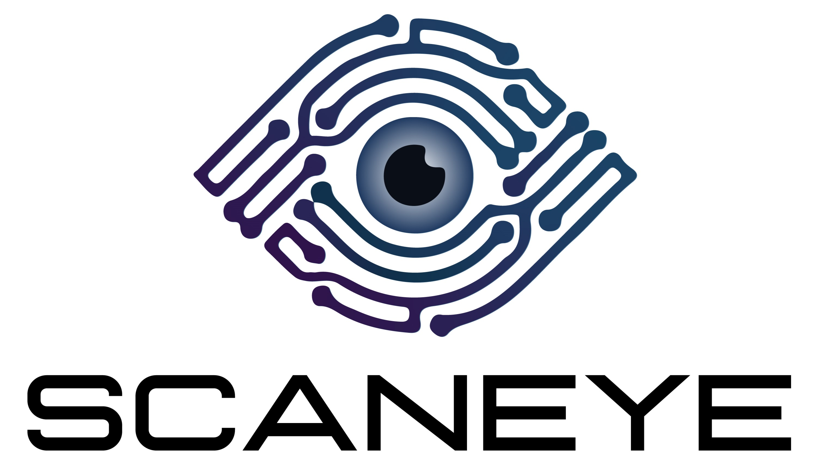

# SCANEYE



## Descripción del proyecto
SCANEYE es un sistema que utiliza reconocimiento ocular para controlar el acceso de las personas 
a áreas de trabajo. Este proyecto tiene como objetivo mejorar la seguridad y facilitar el 
registro de asistencia de manera automática. A través de una cámara, SCANEYE compara en tiempo real
las características oculares con una base de datos para verificar la identidad de los usuarios.

## Antes de descargar nuestro proyecto, necesitas...

Asegúrate de que tu computadora tenga instalado lo siguiente:
- Visual Studio Code
- Python 3.10.0
- MySQL Workbench
- CAMO Studio
- Librerías necesarias

## Librerías necesarias de Python 
Asegúrate de tener instaladas las siguientes librerías antes de ejecutar nuestro proyecto. Puedes instalarlas utilizando `pip`:

```bash
pip install numpy==1.23.0
pip install opencv-python
pip install tkinter
pip install scikit-image  
pip install pickle 
pip install mysql-connector-python
```
## COLABORADORES
Este proyecto fue realizado gracias a:
- **[Fernandajc1](https://github.com/Fernandajc1)**
- **[JeffBC97](https://github.com/JeffBC97)**